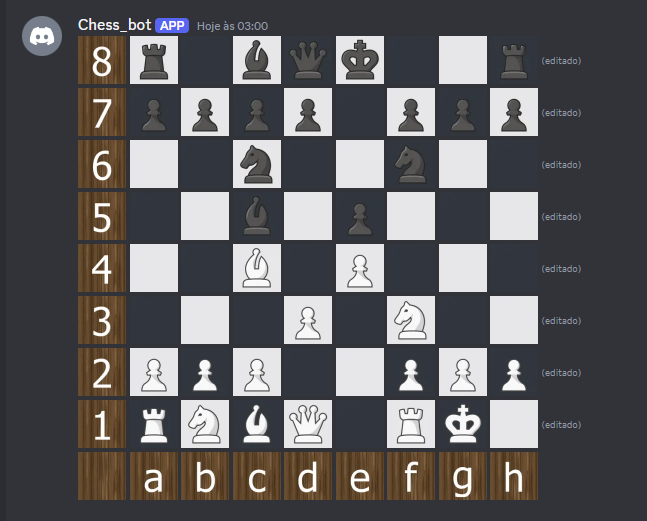

# Discord Chess Bot ♟️

A work-in-progress Discord bot that allows users to play chess against Stockfish Engine directly in Discord, using custom server emojis for the chessboard. 

**⚠️ Note:** This project is currently in active development and may have bugs or incomplete features.

## Features

- Real-time chessboard rendering using Discord emojis
- Play against Stockfish AI (difficulty customizable)
- Basic move validation and turn management
- Supports standard chess moves (pawns, castling, en passant not fully implemented yet)
- Interactive board updates without message spam

## Planned Improvements

- [ ] Pawn promotion support
- [ ] En passant and castling
- [ ] Move history tracking
- [ ] Game state persistence

## Installation & Setup

- Not available until end of project

### Prerequisites

- Python 3.10+
- Discord bot token
- Server ID
- [Stockfish](https://stockfishchess.org/) installed locally
- Discord server with custom chess emojis
